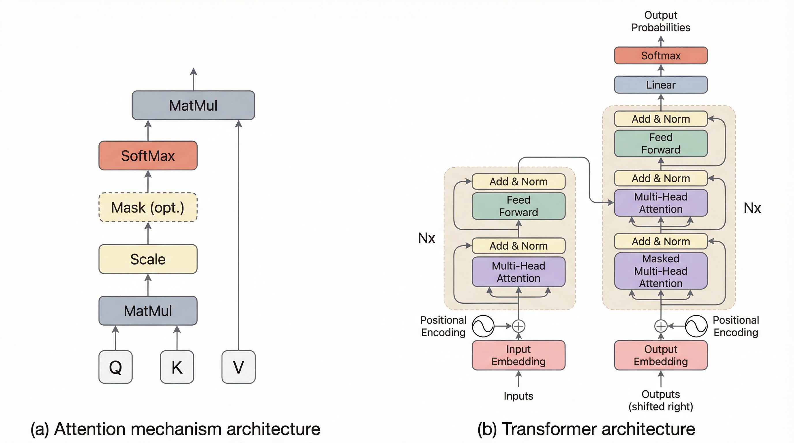
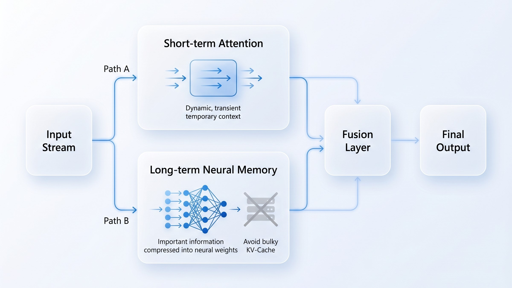

Nếu bạn lạc vào đây, chắc bạn cũng từng thức trắng đêm chỉ để debug cái lỗi `OutOfMemoryError` chết tiệt khi cố nhét thêm vài nghìn token vào prompt. **Vào việc luôn nhé.**

## Cái bẫy $O(N^2)$: Khi "hào quang" 2017 trở thành gánh nặng

Từ năm 2017 đến nay, **Transformer là "vua"**. Cơ chế *Self-Attention* giúp AI hiểu ngữ cảnh cực tốt, nhưng cái giá phải trả là quá đắt. Anh em mình hay gọi đây là **cái bẫy bình phương**.

Hãy thực tế một chút:
*   Bạn muốn mô hình đọc một **repo code khổng lồ**?
*   Hay một **file log dài dằng dặc**?

:::danger[Cái giá của sự chính xác]
Khi bạn gấp đôi chiều dài đầu vào ($N$), chi phí tính toán và bộ nhớ **không tăng gấp đôi** — nó **tăng gấp bốn**. 

Đó là lý do tại sao các lab lớn vẫn phải dùng "chiêu trò" như **RAG (Retrieval-Augmented Generation)**. Nhưng nói thẳng ra: RAG chỉ là đi "nhặt nhạnh" mấy mảnh vụn dữ liệu rồi quăng cho mô hình. Nó không phải là "hiểu" thực sự, nó chỉ là một **miếng băng cá nhân** dán lên cái lỗ hổng kiến trúc của Transformer.
:::

## Nhưng tại sao chúng ta vẫn "cắn răng" xài Transformer?

Nói đi cũng phải nói lại, chê Transformer ngốn VRAM là thế, nhưng tại sao cả thế giới vẫn đổ hàng tỷ đô vào nó? Tại sao những kiến trúc hứa hẹn như Mamba (SSMs) vẫn chưa thể thay thế hoàn toàn được kiến trúc già nua này?

Có **3 lý do thực dụng** mà anh em làm dev cần nhìn nhận:

1.  **Sự ổn định (Stability):** Transformer cực kỳ lỳ lợm. Bạn tăng scale lên hàng chục, hàng trăm tỷ tham số, nó vẫn hội tụ tốt. Mamba hay các mô hình Recurrent khác khi train ở quy mô khổng lồ vẫn thường xuyên gặp hiện tượng mất ổn định.
2.  **Sự chính xác tuyệt đối (High-fidelity Recall):** Attention là cơ chế "duyệt cạn". Nó nhìn trực tiếp vào quá khứ. Mamba nén lịch sử vào một trạng thái cố định (State), mà đã nén thì chắc chắn có mất mát (lossy). Với những việc cần sự chính xác đến từng dấu phẩy như code hay luật pháp, Transformer vẫn là "đỉnh của chóp".
3.  **Hệ sinh thái phần cứng:** Toàn bộ chip GPU, TPU hiện nay đều được tối ưu đến tận "tế bào" cho các phép tính ma trận của Attention. Những kỹ thuật như **Flash Attention** đã kéo cái trần của Transformer lên rất cao.

## Hậu Transformer: Không phải "diệt vong", mà là "tiến hóa"

Kỷ nguyên "Hậu Transformer" không phải là vứt bỏ Attention để chuyển sang một thứ hoàn toàn khác. Đó là **sự lai tạo**.

:::tip[Xu hướng 2025]
Thay vì bắt token thứ 100,001 phải nhìn lại 100,000 token trước đó theo kiểu duyệt cạn, các nghiên cứu mới nhất từ đầu 2025 (như **Titans** của Google) chọn cách giữ lại Attention cho các tác vụ ngắn hạn và dùng **Neural Memory** để xử lý dài hạn.
:::

Lúc này, chúng ta có được:
- **Sự chính xác** của Attention.
- **Tốc độ** và khả năng xử lý chuỗi dài của Linear Scaling.
- **VRAM ổn định**, không còn những cú nhảy vọt làm sập hệ thống.

---

### Tóm lại là...

Transformer chưa chết, và nó sẽ còn sống rất lâu. Nhưng việc bám víu lấy $O(N^2)$ một cách mù quáng là tự sát về mặt tài nguyên. Kỷ nguyên tiếp theo thuộc về những ai biết kết hợp sự **ổn định** của Transformer với **sức mạnh** của Linear Scaling.

Ở bài tiếp theo, tôi sẽ mổ xẻ sâu hơn về **Titans** và cách Google thiết kế một bộ não AI có cả "trí nhớ ngắn hạn" và "trí nhớ dài hạn" thực thụ. 

***

**Nam Nam** | *Blogger*